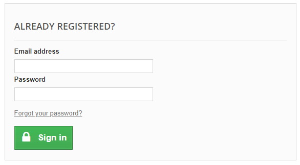

# AutomationPractice.com

## Test Scenarios

### Authentication page

1. Navigation and appearance

| #    | Step                                               | Expected Result                                              |
| ---- | -------------------------------------------------- | ------------------------------------------------------------ |
| 1    | Make sure user is not logged in.                   |                                                              |
| 2    | Click on "Sign In" link it the upper right corner. | Authentication page is opened.                               |
| 3    | Check page base regions.                           | The page contains all base regions. The page style follows the application style guide. |
| 4    | Check page heading.                                | AUTHENTICATION                                               |
| 5    | Check page navigation.                             | [Home]>Authentication                                        |
| 6    | Check page/forms/inputs/ validation alerts.        | No any alerts displayed. All form inputs are clean.          |
| 7    | Check js errors and warnings in dev tools.         | No js error or warnings.                                     |
| 8    | Check "CREATE AN ACCOUNT" form.                    | Displayed.                                                   |
| 9    | Check "ALREADY REGISTERED?" form.                  | Displayed.                                                   |

### Sign in form

2. Sign in form appearance

| #    | Step                                        | Expected Result |
| ---- | ------------------------------------------- | --------------- |
| 1    | Authentication page is opened.              |                 |
| 2    | Check "ALREADY REGISTERED?" form appearance |   |

3. Sign in with empty email

| #    | Step                                        | Expected Result |
| ---- | ------------------------------------------- | --------------- |
| 1 | Authentication page is opened. Email address field is empty. |                 |
| 2 | Click Sign in button. | Error alert: *An email address required.* |

4. Sign in with invalid email

| #    | Step                                        | Expected Result |
| ---- | ------------------------------------------- | --------------- |
| 1 | Authentication page is opened. |                 |
| 2 | Enter invalid email address. Click Sign in button. | Error alert: *Invalid email address.* |

5. Sign in with valid existing email and empty password

| #    | Step                                        | Expected Result |
| ---- | ------------------------------------------- | --------------- |
| 1 | Authentication page is opened. Password field is empty. |                 |
| 2 | Enter email address of the registered user. Click Sign in button. | Error alert: *Password is required.* |

6. Sign in with valid existing email and incorrect password

| #    | Step                                        | Expected Result |
| ---- | ------------------------------------------- | --------------- |
| 1 | Authentication page is opened. |                 |
| 2 | Enter email address and incorrect password of the registered user. Click Sign in button. | Error alert: *Invalid password.* |

7. Sign in with valid existing email and valid password

| #    | Step                                        | Expected Result |
| ---- | ------------------------------------------- | --------------- |
| 1 | Authentication page is opened. |                 |
| 2 | Enter email address and correct password of the registered user. Click Sign in button. | Used is logged in. [My account](link to the page requirement documentation) page is opened. |
| 3 | Check page header navigation menu. | Contains: *Sign out>{First name} {Last name}* Doesn't contain: *Sign in* |

8. Password recover: form appearance

| #    | Step                                        | Expected Result |
| ---- | ------------------------------------------- | --------------- |
| 1 | Authentication page is opened. |                 |
| 21 | Click [Forgot your password?](http://automationpractice.com/index.php?controller=password) link. | "FORGOT YOUR PASSWORD?" form appeared:  |

9. Password recover: navigation back via back button

| #    | Step                                        | Expected Result |
| ---- | ------------------------------------------- | --------------- |
| 1 | Forgot your password form is opened. |                 |
| 2 | Click *Back to Login* button below. | Authentication page is opened. |

10. Password recover: navigation back via breadcrumb

| #    | Step                                        | Expected Result |
| ---- | ------------------------------------------- | --------------- |
| 1 | Forgot your password form is opened. |                 |
| 2 | Click *Authentication* menu in the page breadcrumb. | Authentication page is opened. |

11. Password recover with invalid email

| #    | Step                                        | Expected Result |
| ---- | ------------------------------------------- | --------------- |
| 1 | Forgot your password form is opened. Email address field is empty. |                 |
| 2 | Click *Retrieve Password* button. | Error alert: *Invalid email address.* |
| 3 | Enter invalid email address. Click *Retrieve Password* button. | Error alert: *Invalid email address.* |

12. Password recover with non-existing email

| #    | Step                                        | Expected Result |
| ---- | ------------------------------------------- | --------------- |
| 1 | Forgot your password form is opened. |                 |
| 2 | Enter valid email address of the non-existing user account. Click *Retrieve Password* button. | Error alert: *There is no account registered for this email address.* |

13. Password recover: with existing email

| #    | Step                                        | Expected Result |
| ---- | ------------------------------------------- | --------------- |
| 1 | Forgot your password form is opened. |                 |
| 2 | Enter valid email address of the existing user account. Click *Retrieve Password* button. | Confirmation alert: *A confirmation email has been sent to your address: {entered email address}* |

14. Logged in user navigates to authentication page using URL

| #    | Step                                        | Expected Result |
| ---- | ------------------------------------------- | --------------- |
| 1 | User is logged in. |                 |
| 2 | In browser navigate to the link: http://automationpractice.com/index.php?controller=authentication | Used is logged in. [My account](link to the page requirement documentation) page is opened. |
